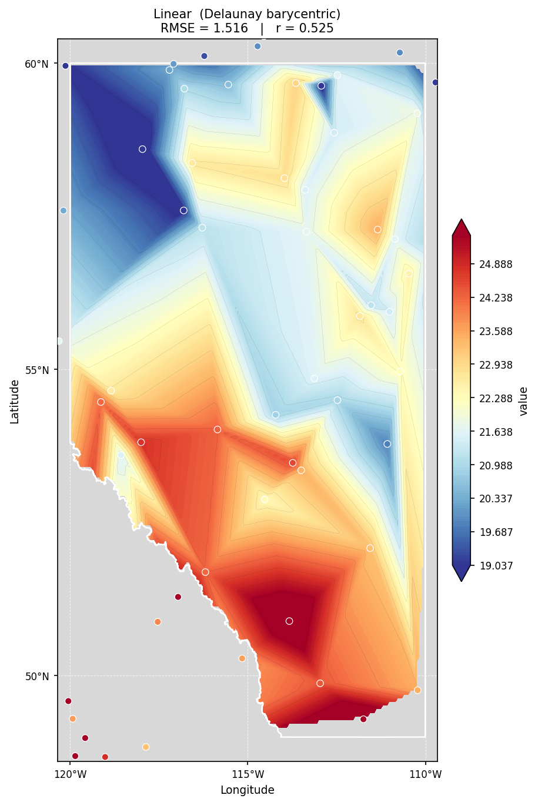
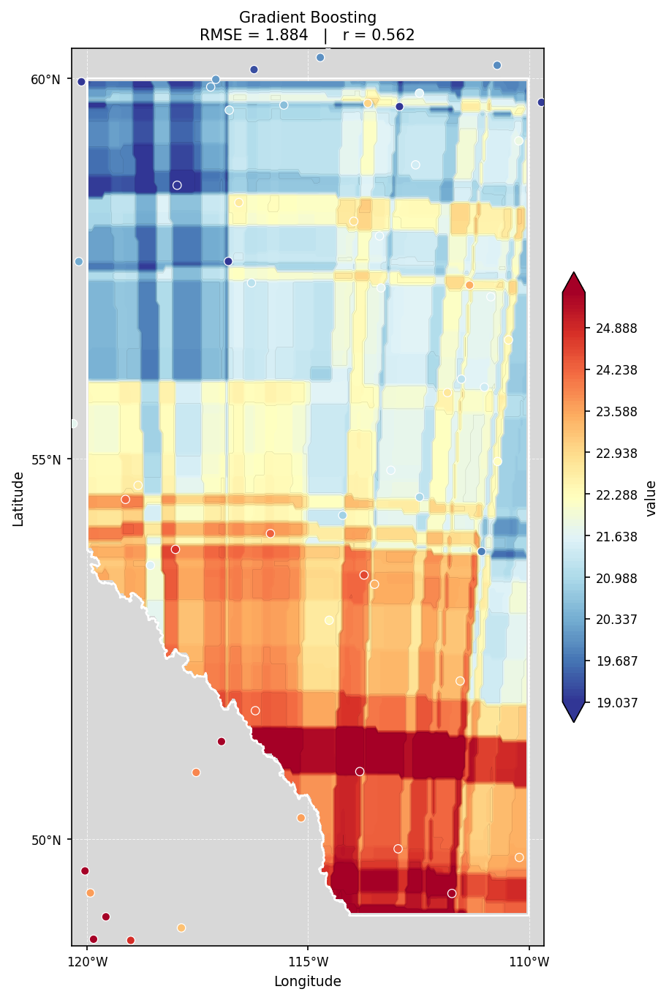

# geointerpo

Python spatial interpolation toolkit — boundaries, point data, 15 methods, raster export, validation.


**[Documentation](https://homayounrezaie.github.io/geonterpo/)** · [Install](https://homayounrezaie.github.io/geonterpo/install/) · [Quickstart](https://homayounrezaie.github.io/geonterpo/quickstart/) · [Methods](https://homayounrezaie.github.io/geonterpo/interpolators/) · [Examples](https://homayounrezaie.github.io/geonterpo/examples/)

---

## Three-step workflow

```
data=        →  boundary=         →  method=
point input     study-area polygon    interpolation algorithm(s)
```

```python
from geointerpo import Pipeline

result = Pipeline(
    data="stations.csv",                    # Step 1 — point data
    boundary="Calgary, Alberta, Canada",    # Step 2 — study area
    method=["idw", "kriging", "spline"],    # Step 3 — methods to compare
).run()

result.plot()            # side-by-side matplotlib comparison
result.metrics_table()   # cross-validation RMSE / MAE / r
result.save("outputs/")  # GeoTIFF + PNG + metrics CSV
```

---

## Features

| Layer | What's included |
|---|---|
| **Pipeline** | 3-step workflow: data → boundary → method |
| **Interpolation** | 15 algorithms · 24 method keys — all ArcGIS Spatial Analyst tools plus GP, RF, GBM, RK |
| **Point data** | CSV · geo file (.shp/.geojson/.gpkg) · GeoDataFrame · API (Meteostat, OpenAQ, Open-Meteo) |
| **Boundary** | Place name · file · 4-corner bbox · polygon / GeoDataFrame |
| **Elevation** | SRTM DEM covariate via srtm.py or GEE (optional) |
| **Export** | GeoTIFF, NetCDF, metrics CSV |
| **Validation** | Compare against MODIS LST, CHIRPS, Sentinel-5P via Google Earth Engine (optional) |
| **Visualization** | Static matplotlib helpers via optional `viz` extra |

---

## Installation

```bash
pip install geointerpo                     # core only (IDW, RBF, spline, griddata)

# Recommended — adds kriging, ML methods, raster I/O, data APIs, matplotlib
pip install "geointerpo[full]"

# With optional extras:
pip install "geointerpo[kriging]"          # + pykrige + scikit-learn
pip install "geointerpo[data]"             # + Meteostat, OpenAQ, Open-Meteo APIs
pip install "geointerpo[raster]"           # + rasterio + rioxarray (GeoTIFF export)
pip install "geointerpo[viz]"              # + matplotlib (static plots)
pip install "geointerpo[gee]"              # + earthengine-api (GEE validation)
pip install "geointerpo[notebooks]"        # + leafmap, geemap, jupyter (interactive notebooks)

# From source:
git clone https://github.com/homayounrezaie/geonterpo
cd geointerpo
pip install -e ".[full]"

# One-time GEE auth (only for GEE validation)
earthengine authenticate
```

### Extras at a glance

| Extra | Adds | Use when |
|---|---|---|
| `kriging` | pykrige, scikit-learn | Kriging and ML methods |
| `raster` | rasterio, rioxarray | GeoTIFF export and boundary clipping |
| `data` | meteostat, openaq, openmeteo-requests | Live station/API data |
| `gee` | earthengine-api | Validating against MODIS/CHIRPS/Sentinel |
| `viz` | matplotlib | Static plots from Python scripts |
| `dem` | srtm.py | SRTM elevation covariate |
| `geo` | geopy | Named-location geocoding (backward-compat) |
| `notebooks` | leafmap, geemap, jupyter | Interactive maps in notebooks |
| `full` | everything except GEE and notebooks | Local dev / data science |
| `dev` | full + GEE + notebooks + testing | Contributors |

> **Note:** `leafmap` and `geemap` are **not** part of the core library.  
> They are notebook/visualization tools available under the `notebooks` extra.  
> The core library uses only `matplotlib` for any optional plotting.

---

## Step 1 — Point data (`data=`)

Supply your point data in any format:

```python
# CSV file — lon/lat/value columns (aliases like "longitude", "latitude" auto-detected)
Pipeline(data="stations.csv", ...)

# Geo file — .shp / .geojson / .gpkg / .zip
Pipeline(data="stations.shp", value_col="temperature", ...)

# GeoDataFrame already in memory
Pipeline(data=my_gdf, ...)

# Live API source — combine with variable= and date=
Pipeline(data="meteostat",  variable="temperature", date="2024-07-15", ...)
Pipeline(data="openaq",     variable="pm25",         date="2024-07-15", ...)
Pipeline(data="openmeteo",  variable="precipitation", date="2024-07-15", ...)
Pipeline(data="sample",     variable="temperature",  ...)   # offline synthetic
```

CSV column names are flexible — `lon_col`, `lat_col`, `value_col` let you point to the right columns:

```python
Pipeline(data="my_data.csv", lon_col="x", lat_col="y", value_col="temp", ...)
```

---

## Step 2 — Boundary (`boundary=`)

Define the study area; grid bbox and output clipping are derived from it automatically.

```python
# Place name — resolved via Nominatim (free, no key)
Pipeline(boundary="Calgary, Alberta, Canada", ...)

# Four corners  (min_lon, min_lat, max_lon, max_lat)
Pipeline(boundary=(-114.5, 50.8, -113.8, 51.3), ...)

# Polygon file
Pipeline(boundary="data/study_area.geojson", ...)

# GeoDataFrame or Shapely geometry
Pipeline(boundary=my_gdf, ...)

# No boundary — grid covers the extent of the point data
Pipeline(data="stations.csv", ...)
```

Direct boundary utilities:

```python
from geointerpo.boundaries import load_boundary, boundary_bbox

boundary = load_boundary("Calgary, AB")    # → normalised GeoDataFrame
bbox     = boundary_bbox(boundary)         # → (min_lon, min_lat, max_lon, max_lat)
```

---

## Step 3 — Methods (`method=` + `method_params=`)

```python
# One method
Pipeline(..., method="kriging")

# Compare multiple methods
Pipeline(..., method=["idw", "kriging", "spline", "rbf"])

# Per-method parameters
Pipeline(
    ...,
    method=["idw", "kriging"],
    method_params={
        "idw":     {"power": 3},
        "kriging": {"variogram_model": "spherical"},
    },
)
```

---

## Complete examples

### Offline demo (no network needed)

```python
from geointerpo import Pipeline

result = Pipeline(
    data="sample",                          # built-in synthetic data
    variable="temperature",
    boundary=(-114.5, 50.8, -113.8, 51.3), # four corners
    method=["idw", "kriging", "spline"],
    resolution=0.1,
).run()

print(result.metrics_table())
result.save("outputs/")
```

### CSV file + city boundary

```python
result = Pipeline(
    data="my_stations.csv",
    boundary="Tehran, Iran",               # geocoded via Nominatim
    method=["kriging", "idw"],
    method_params={"kriging": {"variogram_model": "spherical"}},
    resolution=0.25,
).run()

result.plot()           # static matplotlib figure
result.save("outputs/")
```

### Live API + GEE validation

```python
result = Pipeline(
    data="meteostat",
    variable="temperature",
    date="2024-07-15",
    boundary="Tehran, Iran",
    method=["idw", "kriging", "spline"],
    include_dem=True,            # SRTM elevation covariate
    validate_with_gee=True,      # compare against MODIS LST (requires [gee])
).run()

print(result.metrics_table())
```

### Interactive notebook map

```python
# Requires: pip install 'geointerpo[notebooks]'
import leafmap, tempfile

da = result.grid
with tempfile.NamedTemporaryFile(suffix=".tif", delete=False) as f:
    tmp = f.name
da.rio.set_spatial_dims(x_dim="lon", y_dim="lat").rio.write_crs("EPSG:4326").rio.to_raster(tmp)

m = leafmap.Map(center=[float(da.lat.mean()), float(da.lon.mean())], zoom=6)
m.add_raster(tmp, colormap="RdYlBu_r", layer_name="interpolated")
m   # display in Jupyter
```

### Calgary demo

```bash
python examples/quickstart.py
python examples/calgary_demo.py
geointerpo run configs/calgary.yml
```

### Via YAML config

```bash
geointerpo run configs/temperature.yml
geointerpo run configs/calgary.yml
geointerpo demo temperature
geointerpo benchmark
```

---

## Interpolation Methods

**15 algorithms · 24 method keys.** Every method shares the same API:
`.fit(gdf)` → `.predict(bbox, resolution)` → `xr.DataArray`

### ArcGIS Spatial Analyst equivalents (8 algorithms)

| # | `method=` | Aliases | What it does | Key parameters |
|---|---|---|---|---|
| 1 | `"idw"` | — | Inverse Distance Weighting | `power`, `search_radius` |
| 2 | `"kriging"` | `"ok"`, `"ordinary_kriging"` | Ordinary Kriging | `variogram_model`, `nlags`, `weight` |
| 3 | `"uk"` | `"universal_kriging"` | Universal Kriging — trend + residuals | `variogram_model` |
| 4 | `"natural_neighbor"` | `"nn"` | Natural Neighbor — Voronoi/Sibson area-stealing | — |
| 5 | `"spline"` | `"spline_regularized"` | Spline Regularized — minimum curvature | `smoothing` |
| 6 | `"spline_tension"` | — | Spline Tension — pulls surface toward flat plane | `smoothing` |
| 7 | `"trend"` | — | Polynomial trend surface | `order` (1–12), `regression_type` |
| 8 | `"nearest"` | — | Nearest-neighbour (scipy griddata) | — |

### Additional methods (7 algorithms)

| # | `method=` | Aliases | What it does | Key parameters |
|---|---|---|---|---|
| 9 | `"rbf"` | — | Radial Basis Functions — 8 kernels | `kernel`, `smoothing` |
| 10 | `"linear"` | — | Delaunay linear barycentric interpolation | — |
| 11 | `"cubic"` | — | Clough-Tocher C1 cubic interpolation | — |
| 12 | `"gp"` | `"gaussian_process"` | Gaussian Process — also outputs uncertainty σ | `kernel`, `alpha` |
| 13 | `"rf"` | `"random_forest"` | Random Forest | `n_estimators`, `max_depth` |
| 14 | `"gbm"` | `"gradient_boosting"` | Gradient Boosting | `n_estimators`, `learning_rate` |
| 15 | `"rk"` | `"regression_kriging"` | Regression Kriging — ML trend + Kriging of residuals | `ml_method` |

### Method Output Gallery

All 15 methods run on the same dataset (60 weather stations, Alberta, Canada, 0.25° grid):

<table>
<tr>
  <td align="center"><br/><b>IDW</b></td>
  <td align="center"><br/><b>Ordinary Kriging</b></td>
  <td align="center"><br/><b>Universal Kriging</b></td>
</tr>
<tr>
  <td align="center"><br/><b>Natural Neighbor</b></td>
  <td align="center"><br/><b>Spline (Regularized)</b></td>
  <td align="center"><br/><b>Spline Tension</b></td>
</tr>
<tr>
  <td align="center"><br/><b>Trend Surface</b></td>
  <td align="center"><br/><b>RBF</b></td>
  <td align="center"><br/><b>Nearest Neighbor</b></td>
</tr>
<tr>
  <td align="center"><br/><b>Linear (Delaunay)</b></td>
  <td align="center"><br/><b>Cubic (Clough-Tocher)</b></td>
  <td align="center"><br/><b>Gaussian Process</b></td>
</tr>
<tr>
  <td align="center"><br/><b>Random Forest</b></td>
  <td align="center"><br/><b>Gradient Boosting</b></td>
  <td align="center"><br/><b>Regression Kriging</b></td>
</tr>
</table>

---

### RBF kernels (`kernel=`)

`"thin_plate_spline"` · `"multiquadric"` · `"inverse_multiquadric"` · `"inverse_quadratic"` · `"gaussian"` · `"linear"` · `"cubic"` · `"quintic"`

### Variogram models (`variogram_model=`)

`"linear"` · `"power"` · `"gaussian"` · `"spherical"` · `"exponential"` · `"hole-effect"`

### Per-method parameters

```python
Pipeline(
    data="stations.csv",
    boundary="Tehran, Iran",
    method=["idw", "kriging", "spline", "rbf", "rf"],
    method_params={
        "idw":     {"power": 3},
        "kriging": {"variogram_model": "spherical", "nlags": 12},
        "spline":  {"smoothing": 0.1},
        "rbf":     {"kernel": "thin_plate_spline"},
        "rf":      {"n_estimators": 200},
    },
).run()
```

### Direct interpolator usage

```python
from geointerpo.interpolators import (
    IDWInterpolator,
    KrigingInterpolator,          # mode='ordinary' | 'universal'
    NaturalNeighborInterpolator,
    SplineInterpolator,           # spline_type='regularized' | 'tension'
    TrendInterpolator,            # order=1..12
    RBFInterpolator,              # kernel='thin_plate_spline' | ...
    GridDataInterpolator,         # method='nearest' | 'linear' | 'cubic'
    MLInterpolator,               # method='gp' | 'rf' | 'gbm'
    RegressionKrigingInterpolator,
)

model = KrigingInterpolator(variogram_model="spherical").fit(gdf)
grid  = model.predict(bbox=(5, 44, 25, 56), resolution=0.25)   # xr.DataArray
cv    = model.cross_validate(gdf, k=5)                         # blocked spatial CV

# Gaussian Process — also returns uncertainty grid
mean, std = MLInterpolator(method="gp").fit(gdf).predict_with_std(bbox)
```

---

## Boundary Loading

`geointerpo.boundaries` provides a unified entry point that accepts any boundary format:

```python
from geointerpo.boundaries import load_boundary, boundary_bbox

# Place name (Nominatim — free, no key needed)
boundary = load_boundary("Calgary, Alberta, Canada")
boundary = load_boundary("Calgary, AB", provider="osmnx")   # richer polygons (pip install osmnx)

# File path
boundary = load_boundary("data/calgary_boundary.geojson")   # .geojson / .gpkg / .shp / .zip

# GeoDataFrame or Shapely geometry (passthrough)
boundary = load_boundary(my_gdf)
boundary = load_boundary(shapely_polygon)

# All outputs are normalised to EPSG:4326, dissolved, make_valid'd
bbox = boundary_bbox(boundary)   # (min_lon, min_lat, max_lon, max_lat)
```

| Input type | Handled by |
|---|---|
| `.geojson` / `.gpkg` / `.shp` / `.zip` | `geopandas.read_file` |
| Place name string | Nominatim `polygon_geojson=1` (default) or osmnx |
| GeoDataFrame | Passthrough + reproject + dissolve |
| Shapely geometry | Wrapped into one-row GeoDataFrame |

---

## ArcGIS Input Parameters → geointerpo equivalents

| ArcGIS parameter | geointerpo equivalent |
|---|---|
| Input point features | `data=` (CSV / geo file / GeoDataFrame / API source) |
| Z value field | `value_col=` (default `"value"`) |
| Output cell size | `resolution=` (degrees) |
| Study area / mask | `boundary=` + `clip_to_boundary=True` |
| Search radius — Variable(n) | `SearchRadius.variable(n=12)` |
| Search radius — Fixed(dist) | `SearchRadius.fixed(distance_m=50000)` |
| Output variance raster | `grid.attrs["variance"]` (Kriging) |
| Semivariogram properties | `variogram_model`, `nlags`, `weight` |
| Spline type / weight | `spline_type`, `smoothing` |
| Polynomial order | `TrendInterpolator(order=2)` |
| Regression type | `TrendInterpolator(regression_type="logistic")` |
| Barriers | `clip_to_polygon(grid, polygon)` in `geointerpo.io` |
| DEM / elevation covariate | `include_dem=True` |

---

## Data Sources

| Source | Variables | API key |
|---|---|---|
| `MeteostatSource` | temp, tmin, tmax, prcp, wspd, pres, … | No |
| `OpenAQSource` | pm25, pm10, no2, o3, so2, co | No (optional for higher limits) |
| `OpenMeteoSource` | temperature_2m_mean, precipitation_sum, … | No |
| `sample` | temperature, precipitation, air_quality | No (offline, synthetic) |

---

## GEE Validation Products

Requires `pip install 'geointerpo[gee]'` and `earthengine authenticate`.

| Variable | GEE Dataset | Notes |
|---|---|---|
| Temperature | `MODIS/061/MOD11A1` | LST → °C |
| Precipitation | `UCSB-CHG/CHIRPS/DAILY` | mm/day |
| PM2.5 / Aerosol | `COPERNICUS/S5P/NRTI/L3_AER_AI` | Absorbing aerosol index |
| O3 | `COPERNICUS/S5P/NRTI/L3_O3` | Column density |
| NO2 | `COPERNICUS/S5P/NRTI/L3_NO2` | Tropospheric column |

---

## Three-command first run

```bash
pip install -e ".[kriging]"
pytest -q -m "not network and not gee"
python examples/quickstart.py
```

---

## Running Tests

```bash
# Offline only (fast, no network)
pytest tests/ -m "not network and not gee" -v

# All tests (requires network)
pytest tests/ -v --cov=geointerpo
```

---

## Stack

**Core:** `scipy` · `geopandas` · `shapely` · `pyproj` · `xarray` · `numpy` · `pandas` · `requests`

**Optional — interpolation:** `pykrige` · `scikit-learn`

**Optional — I/O:** `rasterio` · `rioxarray`

**Optional — data APIs:** `meteostat` · `openaq` · `openmeteo-requests` · `requests-cache`

**Optional — DEM:** `srtm.py` · (earthengine-api)

**Optional — validation:** `earthengine-api`

**Optional — visualization:** `matplotlib` (static) · `leafmap` (interactive, notebooks only)

**Optional — geocoding:** `geopy`

---

## References

- [A Guide to Spatial Interpolation of Precipitation with Python](https://medium.com/@adyaksa_raharja/a-guide-to-spatial-interpolation-of-precipitation-with-python-342bad9422b3)
- [ArcGIS Pro — Interpolation Tools Overview](https://pro.arcgis.com/en/pro-app/latest/tool-reference/spatial-analyst/an-overview-of-the-interpolation-tools.htm)

- [GeoStat-Framework/PyKrige](https://github.com/GeoStat-Framework/PyKrige) — Ordinary, universal, 3D, and regression kriging
- [GeoStat-Framework/GSTools](https://github.com/GeoStat-Framework/GSTools) — Covariance models, variograms, random fields, kriging
- [mmaelicke/scikit-gstat](https://github.com/mmaelicke/scikit-gstat) — SciPy-style variogram estimation and ordinary kriging

- [DataverseLabs/pyinterpolate](https://github.com/DataverseLabs/pyinterpolate) — Spatial statistics: IDW, kriging, Poisson kriging
- [fatiando/verde](https://github.com/fatiando/verde) — Machine-learning-style spatial gridding
- [GeostatsGuy/GeostatsPy](https://github.com/GeostatsGuy/GeostatsPy) — GSLIB-based geostatistics

https://towardsdatascience.com/3-best-methods-for-spatial-interpolation-912cab7aee47/