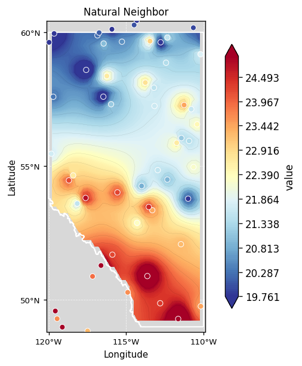
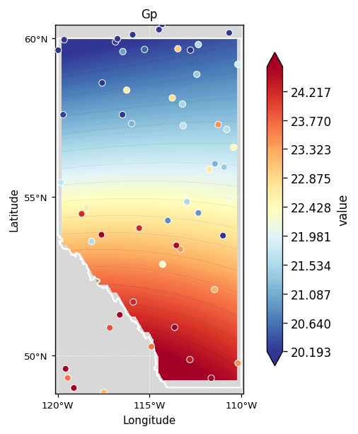
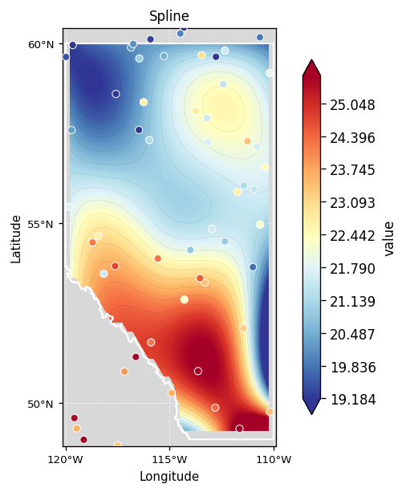

# geointerpo

<p align="center">
  
  
  
  
</p>

<p align="center">
  Spatial interpolation for Python — 15 algorithms, live data APIs, boundary clipping, and GEE validation.<br/>
  Drop in point data, get a smooth interpolated raster out.
</p>

<p align="center">
  <a href="https://homayounrezaie.github.io/geonterpo"><b>📖 Documentation</b></a> ·
  <a href="https://homayounrezaie.github.io/geonterpo/install/">Install</a> ·
  <a href="https://homayounrezaie.github.io/geonterpo/quickstart/">Quickstart</a> ·
  <a href="https://homayounrezaie.github.io/geonterpo/interpolators/">Methods</a> ·
  <a href="https://homayounrezaie.github.io/geonterpo/examples/">Examples</a>
</p>

---

<p align="center">
  
  &nbsp;&nbsp;
  
  &nbsp;&nbsp;
  
</p>
<p align="center"><i>Ordinary Kriging · Natural Neighbor · Gaussian Process — same 60 stations, Alberta, Canada</i></p>

---

## Install

```bash
pip install "geointerpo[full]"
```

## Quickstart

```python
from geointerpo import Pipeline

result = Pipeline(
    data="stations.csv",               # CSV, GeoDataFrame, or live API
    boundary="Calgary, Alberta",       # place name, bbox, or polygon file
    method=["idw", "kriging", "spline"],
).run()

result.plot()            # side-by-side comparison
result.metrics_table()   # cross-validation RMSE / r
result.save("outputs/")  # GeoTIFF + PNG + CSV
```

---

## Methods

geointerpo covers the full ArcGIS Spatial Analyst interpolation toolkit plus modern ML methods. All share the same interface — swap `method=` to compare.

### Classical

Fast and assumption-free. Good as a baseline or when data is dense.

<p align="center">
  
  &nbsp;
  
  &nbsp;
  
</p>

`idw` · `rbf` · `spline` · `spline_tension` · `trend` · `nearest` · `linear` · `cubic`

### Geostatistical

Account for spatial autocorrelation. Produce statistically optimal estimates with cross-validation metrics.

<p align="center">
  
  &nbsp;&nbsp;
  
</p>

`kriging` · `uk` (Universal Kriging) · `natural_neighbor`

### Machine Learning

Capture non-linear spatial patterns. GP also returns a per-pixel uncertainty surface.

<p align="center">
  
  &nbsp;
  
  &nbsp;
  
</p>

`gp` (Gaussian Process) · `rf` (Random Forest) · `gbm` (Gradient Boosting) · `rk` (Regression Kriging)

---

## References

- [ArcGIS Pro — Interpolation Tools Overview](https://pro.arcgis.com/en/pro-app/latest/tool-reference/spatial-analyst/an-overview-of-the-interpolation-tools.htm)
- [3 Best Methods for Spatial Interpolation — Towards Data Science](https://towardsdatascience.com/3-best-methods-for-spatial-interpolation-912cab7aee47/)
- [GeoStat-Framework/PyKrige](https://github.com/GeoStat-Framework/PyKrige) — Ordinary, Universal, and Regression Kriging
- [GeoStat-Framework/GSTools](https://github.com/GeoStat-Framework/GSTools) — Covariance models, variograms, random fields
- [mmaelicke/scikit-gstat](https://github.com/mmaelicke/scikit-gstat) — Variogram estimation and ordinary kriging
- [DataverseLabs/pyinterpolate](https://github.com/DataverseLabs/pyinterpolate) — IDW, kriging, Poisson kriging
- [fatiando/verde](https://github.com/fatiando/verde) — Machine-learning-style spatial gridding
- [GeostatsGuy/GeostatsPy](https://github.com/GeostatsGuy/GeostatsPy) — GSLIB-based geostatistics
