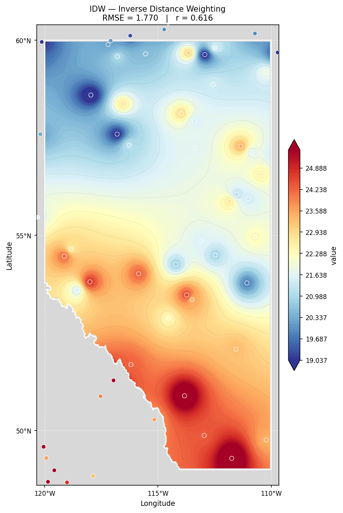
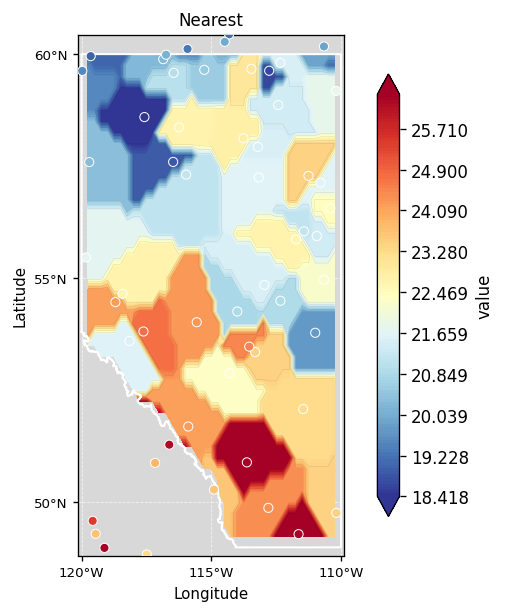
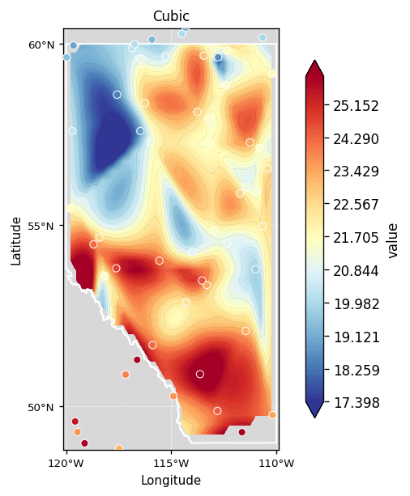
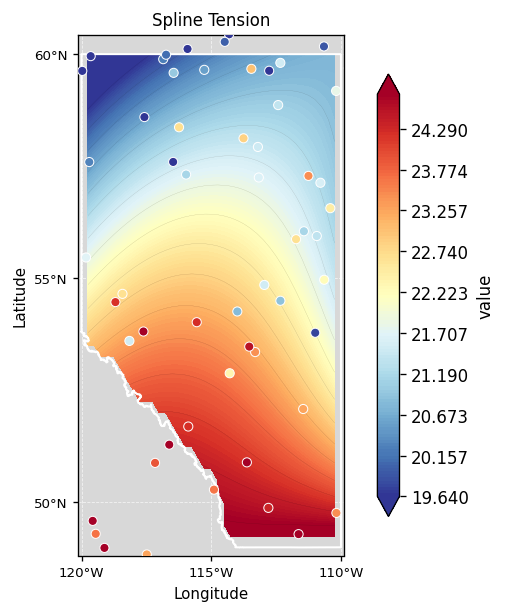
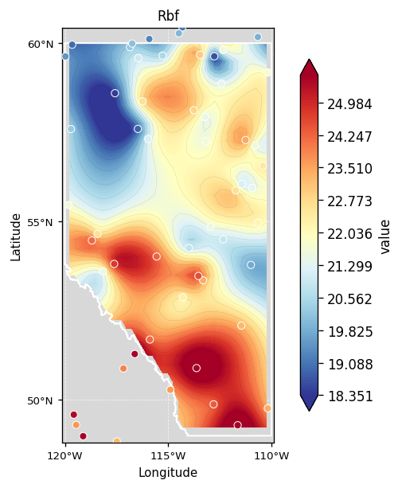
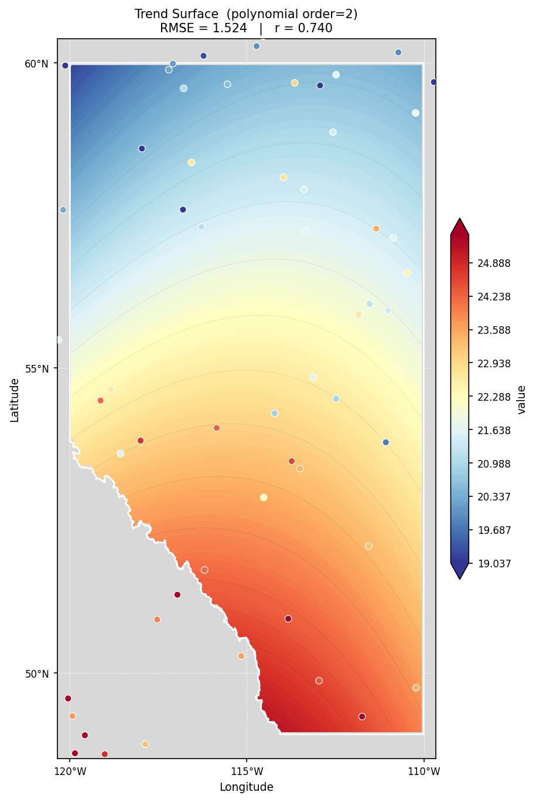
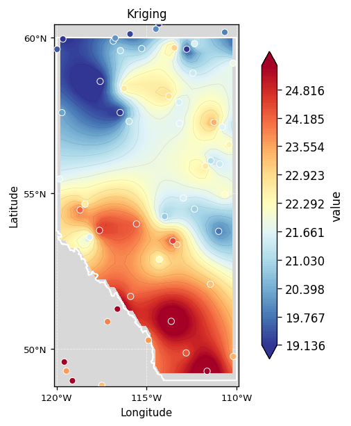
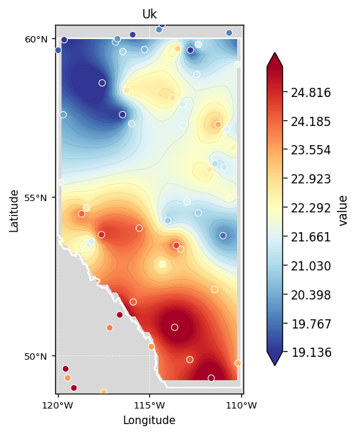
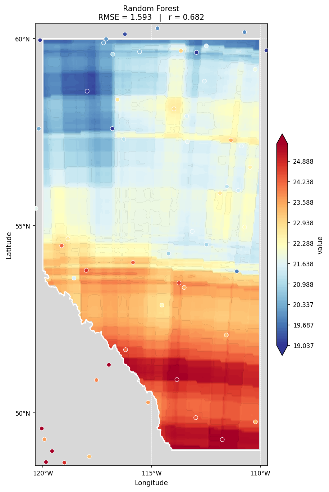
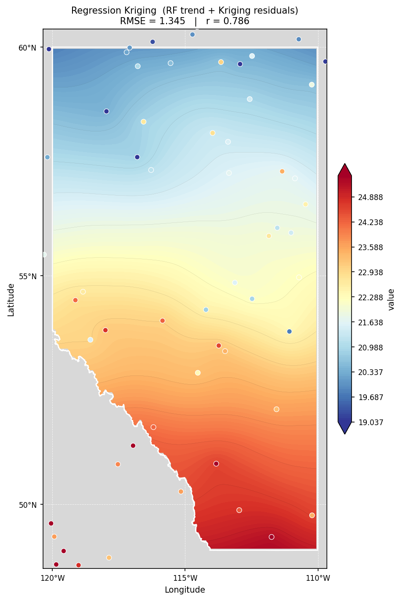

# Methods

**18 canonical methods · 28 accepted method keys.**  
Every method shares `.fit(gdf)` → `.predict(bbox, resolution)` → `xr.DataArray`.  
Swap `method=` to compare — everything else stays the same.

---

## Distance-based

Fast and assumption-free. Good as a baseline or when data is dense and evenly distributed.

<div class="method-row" markdown>
  <figure><figcaption>IDW</figcaption></figure>
  <figure><figcaption>Nearest Neighbor</figcaption></figure>
  <figure><figcaption>Linear (Delaunay)</figcaption></figure>
  <figure><figcaption>Cubic (Clough-Tocher)</figcaption></figure>
</div>

| Key | Description | Key params |
|---|---|---|
| `idw` | Inverse Distance Weighting — **KD-tree vectorized** (v0.2, 50–200× faster) | `power`, `n_neighbors` |
| `nearest` | Nearest-neighbour via scipy griddata | — |
| `linear` | Delaunay triangulation, linear barycentric | — |
| `cubic` | Clough-Tocher C¹ cubic | — |

!!! tip
    Higher `power` in IDW makes the surface more local — distant stations contribute less.
    Use `n_neighbors=10` to restrict each prediction to the 10 nearest stations.

---

## Spline & Trend

Fit smooth continuous surfaces. Splines minimise curvature; RBF offers 8 kernel choices; Trend fits a global polynomial for large-scale patterns.

<div class="method-row" markdown>
  <figure><figcaption>Spline (Regularized)</figcaption></figure>
  <figure><figcaption>Spline Tension</figcaption></figure>
  <figure><figcaption>RBF</figcaption></figure>
  <figure><figcaption>Trend Surface</figcaption></figure>
</div>

| Key | Description | Key params |
|---|---|---|
| `spline` | Minimum curvature regularized spline | `smoothing` |
| `spline_tension` | Tension spline — flatter between points | `smoothing` |
| `rbf` | Radial Basis Functions | `kernel`, `smoothing` |
| `trend` | Global polynomial trend surface | `order` (1–12) |

**RBF kernels:** `thin_plate_spline` · `multiquadric` · `inverse_multiquadric` · `inverse_quadratic` · `gaussian` · `linear` · `cubic` · `quintic`

---

## Geostatistical

Account for spatial autocorrelation via a variogram model. Produce statistically optimal, unbiased estimates. Natural Neighbor uses Voronoi area-stealing weights — smooth and exact at data locations.

<div class="method-row" markdown>
  <figure><figcaption>Ordinary Kriging</figcaption></figure>
  <figure><figcaption>Universal Kriging</figcaption></figure>
  <figure><figcaption>Natural Neighbor</figcaption></figure>
</div>

| Key | Aliases | Description | Key params |
|---|---|---|---|
| `kriging` | `ok`, `ordinary_kriging` | Ordinary Kriging — returns **variance surface** | `variogram_model`, `nlags`, `anisotropy_scaling`, `anisotropy_angle` |
| `uk` | `universal_kriging` | Universal Kriging — detrended residuals | `variogram_model` |
| `natural_neighbor` | `nn` | Voronoi/Sibson area-stealing weights | — |
| `cokriging` | `ked` | **Kriging with External Drift** — uses a secondary correlated variable | `secondary_col`, `secondary_fn`, `variogram_model` |
| `sgs` | `simulation` | **Sequential Gaussian Simulation** — stochastic realizations | `n_realizations`, `variogram_model` |

**Variogram models:** `linear` · `power` · `gaussian` · `spherical` · `exponential` · `hole-effect`

!!! note "Requires kriging extra"
    ```bash
    pip install "geointerpo[kriging]"
    ```

!!! note "Cokriging and SGS require gstools"
    ```bash
    pip install "geointerpo[geostat]"
    # or: pip install gstools
    ```

### Kriging variance surface (new in v0.2)

```python
from geointerpo.interpolators import KrigingInterpolator

model = KrigingInterpolator(
    variogram_model="spherical",
    anisotropy_scaling=0.5,  # 2:1 anisotropy ratio
    anisotropy_angle=45.0,   # major axis direction (degrees, clockwise from North)
).fit(gdf)

mean_da, var_da = model.predict_with_variance(bbox, resolution=0.1)
# mean_da: best estimate
# var_da:  prediction variance (highest where far from stations)
```

### Sequential Gaussian Simulation

```python
from geointerpo.interpolators import SGSInterpolator

model = SGSInterpolator(n_realizations=100).fit(gdf)
mean_da, std_da = model.predict_with_std(bbox)   # ensemble statistics
realizations = model.realize(bbox)               # (100, lat, lon) DataArray
```

---

## Machine Learning

Capture non-linear spatial patterns without variogram assumptions. GP also returns a per-pixel uncertainty surface alongside the mean prediction. Regression Kriging combines an ML trend with Kriging of the residuals.

<div class="method-row" markdown>
  <figure><figcaption>Gaussian Process</figcaption></figure>
  <figure><figcaption>Random Forest</figcaption></figure>
  <figure><figcaption>Gradient Boosting</figcaption></figure>
  <figure><figcaption>Regression Kriging</figcaption></figure>
</div>

| Key | Aliases | Description | Key params |
|---|---|---|---|
| `gp` | `gaussian_process` | Gaussian Process — mean + σ output | `length_scale`, `alpha` |
| `rf` | `random_forest` | Random Forest — **bootstrap uncertainty** | `n_estimators`, `max_depth` |
| `gbm` | `gradient_boosting` | Gradient Boosting — MAPIE conformal UQ | `n_estimators`, `learning_rate` |
| `rk` | `regression_kriging` | ML trend + Kriging of residuals | `ml_method` |

---

## Uncertainty quantification {#uncertainty}

Every major method now supports prediction uncertainty (new in v0.2):

```python
from geointerpo.interpolators import MLInterpolator, KrigingInterpolator

# --- GP: native posterior standard deviation ---
gp = MLInterpolator(method="gp").fit(gdf)
mean, lower, upper = gp.predict_with_uncertainty(bbox, alpha=0.1)  # 90% interval

# --- RF: bootstrap intervals from tree ensemble ---
rf = MLInterpolator(method="rf").fit(gdf)
mean, lower, upper = rf.predict_with_uncertainty(bbox, alpha=0.1)

# --- Kriging: prediction variance surface ---
kr = KrigingInterpolator().fit(gdf)
mean_da, var_da = kr.predict_with_variance(bbox)
```

For GBM, install MAPIE for conformal prediction:
```bash
pip install "geointerpo[uncertainty]"
# or: pip install mapie
```

---

## Spatial cross-validation

```python
from geointerpo.validation.metrics import spatial_cv

# Blocked k-fold (default — fast, good for most cases)
result = spatial_cv(model, gdf, strategy="block", k=5)

# LOO with 50 km buffer — removes autocorrelation leakage
result = spatial_cv(model, gdf, strategy="loo", buffer_km=50)

print(result["rmse"], result["r"], result["per_fold"])
```

---

## Direct usage

```python
from geointerpo.interpolators import KrigingInterpolator

model = KrigingInterpolator(variogram_model="spherical")
model.fit(gdf)                                   # GeoDataFrame with Point geometry + 'value'
grid  = model.predict(bbox, resolution=0.25)     # xr.DataArray (WGS-84)
cv    = model.cross_validate(gdf, k=5)           # blocked spatial k-fold CV
```

→ Full parameter reference in [API: Interpolators](api/interpolators.md)
